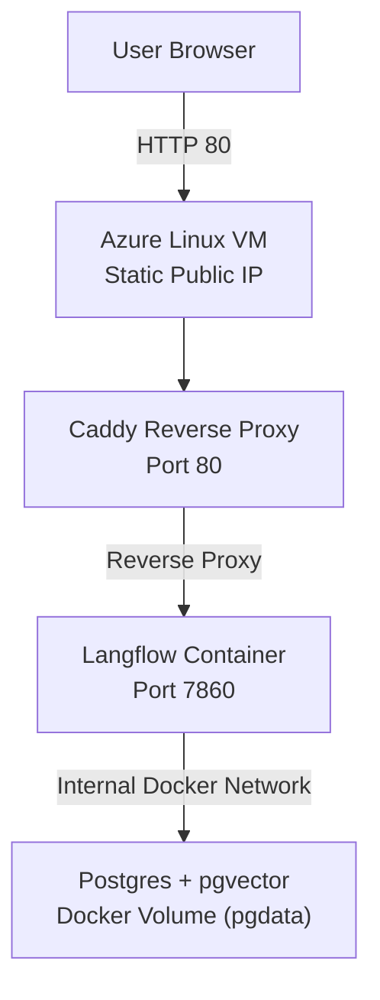

  
  
  

# Langflow Platform — Azure Deployment Demo

Production-style deployment of Langflow with persistent storage, reverse proxy, and cloud networking controls on Microsoft Azure.

This project demonstrates containerized AI platform deployment using Docker Compose and is architected for portability to Kubernetes (AKS, EKS, GKE).

## Live Demo

http://20.121.40.238/

## Deployment Summary

-Dockerized Langflow + PostgreSQL

-Deployed to Azure Linux VM

-Public IP configured as Static

-Reverse proxy via Caddy

-Database isolated from public internet

-Environment-based secret management

## Kubernetes

A `/k8s` directory contains Kubernetes manifests prepared for deploying this stack to managed clusters (AKS, EKS, or GKE).

The current live demo runs via Docker Compose on a VM for simplicity, but the architecture is containerized and portable to Kubernetes environments.

## AI-Assisted Development (Claude Code)

Claude Code was used during this project to:

-Refactor and validate docker-compose.yml configuration

-Troubleshoot Docker and VM deployment issues

-Generate infrastructure setup steps (Azure VM + Caddy reverse proxy)

-Draft architecture documentation and deployment instructions

## Skills Demonstrated

-Docker orchestration

-Reverse proxy configuration (Caddy)

-Cloud VM provisioning (Azure)

-Static IP and NSG configuration

-Container networking

-Secure app + database separation

-AI platform deployment
