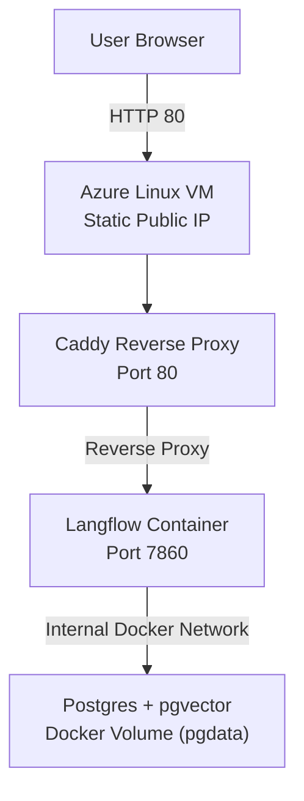

# Langflow Platform — Azure Deployment Demo

Live deployed Langflow stack running on an Azure Linux VM using Docker Compose and Caddy reverse proxy.

## Live Demo

http://20.121.40.238/

## Deployment Summary

Dockerized Langflow + Postgres

Deployed to Azure Linux VM

Public IP configured as Static

Reverse proxy via Caddy

Database isolated from public internet

Environment-based secret management

## AI-Assisted Development (Claude Code)

Claude Code was used during this project to:

Refactor and validate docker-compose.yml configuration

Troubleshoot Docker and VM deployment issues

Generate infrastructure setup steps (Azure VM + Caddy reverse proxy)

Draft architecture documentation and deployment instructions

## Skills Demonstrated

Docker orchestration

Cloud VM provisioning (Azure)

Reverse proxy configuration

Network security (NSG rules)

Production-style app + database separation

Public AI tool deployment
